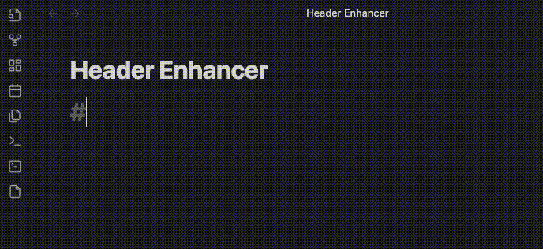

<h1 align="center">Obsidian Header Enhancer</h1>

[[中文](./README.zh.md)] [[English](./README.md)]

This plugin is designed to enhance the header of [Obsidian](https://obsidian.md). The plugin will auto-detect the header level and add the number to the header.

**Warning:**
- This plugin is still in the early stage of development, so there may be some bugs. If you find any bugs, please feel free to report them in the [issue](https://github.com/HoBeedzc/obsidian-header-enhancer-plugin/issues)
- Data is invaluable, so please remember to create backups when using the beta plugin (which version number like 0.x.x).

## Core Features
### 1. Header Auto Numbering
Header auto numbering provides the ability to add numbers to the header. The number will be added to the header when you press `Enter` key to create a new line and it will be updated when you change the header level.

**Example:**

**Warning:**
- Header Auto Numbering use `\t` split auto-number and your header. If your header contains `\t`, Header Auto Numbering may not work properly.
- Header Auto Numbering will modify your Markdown source file directly, so that can be rendered in other Markdown editors. 

### 2. Isolate Title Font [W.I.P]
Isolate title font provides the ability to isolate the title font from the content. 

## Installation

### From Obsidian
1. Open Settings -> Third-party plugins
2. Disable Safe mode
3. Click Browse community plugins
4. Search for "Header Enhancer"
5. Click Install
6. Once installed, close the community plugins window and enable the newly installed plugin

### From GitHub
1. Download the [Latest release](https://github.com/HoBeedzc/obsidian-header-enhancer-plugin/releases/latest)
2. Extract the zip archive in `<vault>/.obsidian/plugins/` so that the `main.js` file is within the folder `<vault>/.obsidian/plugins/header-enhancer/`.
3. Reload Obsidian
4. If prompted about Safe Mode, you can disable safe mode and enable the plugin.

## Usage
### Header Auto Numbering
Header auto-numbering is enabled by default. You can disable it in the plugin settings.

#### a. Change auto number start header level
You can change the auto number start header level in the plugin settings. The default value is `1` which means auto number start from H1 or `#`.

#### b. Custom your numbering style
You can customize your numbering style and observe the style preview in the plugin settings. Currently, only custom separator are supported. 

## Known bugs
Here are some known bugs, I will fix them as soon as possible.
- [ ] Header Auto Numbering will not work properly when the header contains `\t`.
- [ ] When you change the header level, the auto number will not be updated immediately. You need move cursor to header line and press `Enter` key to update it.
- [ ] Markdown Table may not work properly when the plugin is enabled. 

## Todo list
- [ ] Support diffierent separator split auto-number and your header.(Now only supprot `\t`) - Header Auto Numbering
- [ ] Setting support Chinese. - Header Enhancer

## ChangeLog
Full changelog can be found [here](./doc/changelog.md).

## Acknowledgements
- https://github.com/Yaozhuwa/easy-typing-obsidian

## Support
If you like this plugin, you can support me by:

